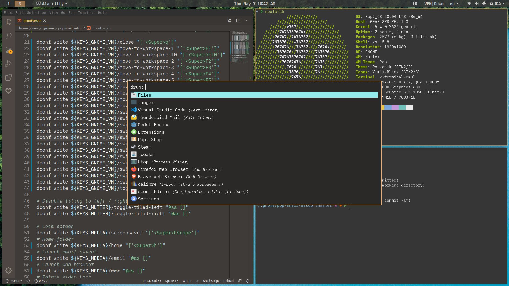

# My Pop setup

## Keyboard bindings

Keyboard bindings for Pop-Shell tiling are available in dconfvm.sh. To run it don't forget to change mod to a+x.

Keyboard shortcuts are kind of similar to i3.

## Extensions

Extensions that are included in this repo are:

- Top panel color: You can use this to change the gnome top panel's color to any color even alpha.

- i3 Like Workspaces: A modified version of Workspace indicator gnome extension: https://extensions.gnome.org/extension/21/workspace-indicator/.
Changes are: Removed the workspace indicator borders and gave a solid color. Show workspaces horizontal and only show workspaces that is active or has a window in it. And moved the extension to the most left of the panel.

### Other Extensions I use

Next to the extensions I provide these go well to provide a nice tiling wm experience:

- Auto move windows : https://gitlab.gnome.org/GNOME/gnome-shell-extensions/-/tree/master/extensions/auto-move-windows
- Mininum workspaces : https://github.com/philbot9/gnome-shell-minimum-workspaces

- Hide activities button.

- Pop shell launcher alternative: rofi

